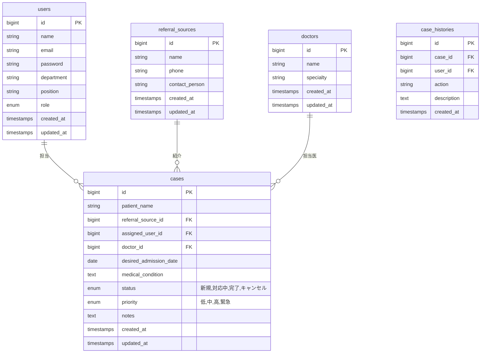

# 設計書

## 概要

Support CubeはLaravelフレームワークを使用したWebアプリケーションで、病院の入院受け入れ調整業務を効率化するシステムです。MVCアーキテクチャを採用し、PC環境での利用に最適化されたデザインを提供します。

## アーキテクチャ

### システム構成

```
┌─────────────────┐    ┌─────────────────┐    ┌─────────────────┐
│   フロントエンド   │    │   バックエンド    │    │   データベース   │
│                 │    │                 │    │                 │
│ - Blade Template│◄──►│ - Laravel 10.x  │◄──►│ - MySQL 8.0     │
│ - Bootstrap 5   │    │ - PHP 8.1+      │    │                 │
│ - 基本JavaScript │    │ - Eloquent ORM  │    │                 │
└─────────────────┘    └─────────────────┘    └─────────────────┘
```

### レイヤー構成

1. **プレゼンテーション層**
   - Bladeテンプレート
   - Bootstrap 5によるPC最適化UI
   - 基本的なJavaScript（必要最小限）

2. **アプリケーション層**
   - Laravelコントローラー
   - フォームリクエスト（バリデーション）
   - ミドルウェア（認証・認可）

3. **ドメイン層**
   - Eloquentモデル
   - ビジネスロジック
   - サービスクラス

4. **インフラストラクチャ層**
   - データベース（MySQL）
   - セッション管理（ファイルベース）

## コンポーネントと インターフェース

### 主要コンポーネント

#### 1. 認証システム
- **AuthController**: ログイン・ログアウト処理
- **AuthMiddleware**: 認証チェック
- **RoleMiddleware**: 権限チェック

#### 2. マスター管理システム
- **StaffController**: スタッフ管理
- **ReferralSourceController**: 紹介元管理  
- **DoctorController**: 医師管理

#### 3. 案件管理システム
- **CaseController**: 案件CRUD操作
- **CaseSearchController**: 案件検索
- **CaseAssignmentController**: 担当者別案件管理

#### 4. カレンダーシステム
- **CalendarController**: カレンダー表示
- **CalendarApiController**: Ajax API

#### 5. ダッシュボードシステム
- **DashboardController**: ダッシュボード表示と統計データ取得

### API設計

#### RESTful API エンドポイント

```
# 認証
POST   /login                    # ログイン
POST   /logout                   # ログアウト

# スタッフ管理
GET    /staff                    # スタッフ一覧
GET    /staff/create             # スタッフ登録フォーム
POST   /staff                    # スタッフ登録
GET    /staff/{id}               # スタッフ詳細
GET    /staff/{id}/edit          # スタッフ編集フォーム
PUT    /staff/{id}               # スタッフ更新
DELETE /staff/{id}               # スタッフ削除

# 紹介元管理
GET    /referral-sources         # 紹介元一覧
POST   /referral-sources         # 紹介元登録
PUT    /referral-sources/{id}    # 紹介元更新
DELETE /referral-sources/{id}    # 紹介元削除

# 医師管理
GET    /doctors                  # 医師一覧
POST   /doctors                  # 医師登録
PUT    /doctors/{id}             # 医師更新
DELETE /doctors/{id}             # 医師削除

# 案件管理
GET    /cases                    # 案件一覧
POST   /cases                    # 案件登録
GET    /cases/{id}               # 案件詳細
PUT    /cases/{id}               # 案件更新
DELETE /cases/{id}               # 案件削除

# 案件検索
GET    /cases/search             # 案件検索

# カレンダー
GET    /calendar                 # カレンダー表示
GET    /api/calendar/{year}/{month} # カレンダーデータAPI

# ダッシュボード
GET    /                         # ダッシュボード表示
```

## データモデル

### ER図



### モデル仕様

#### User（ユーザー/スタッフ）
- **id**: 主キー
- **name**: 氏名（必須）
- **email**: メールアドレス（必須、ユニーク）
- **password**: パスワード（ハッシュ化）
- **department**: 所属部署（必須）
- **position**: 役職
- **role**: 権限（admin, staff）

#### ReferralSource（紹介元）
- **id**: 主キー
- **name**: 医療機関名（必須）
- **phone**: 電話番号（必須）
- **contact_person**: 担当者名

#### Doctor（医師）
- **id**: 主キー
- **name**: 医師名（必須）
- **specialty**: 専門科（必須）

#### Case（案件）
- **id**: 主キー
- **patient_name**: 患者名（必須）
- **referral_source_id**: 紹介元ID（外部キー）
- **assigned_user_id**: 担当者ID（外部キー）
- **doctor_id**: 担当医ID（外部キー）
- **desired_admission_date**: 希望入院日
- **medical_condition**: 病状
- **status**: ステータス（新規, 対応中, 完了, キャンセル）
- **priority**: 優先度（低, 中, 高, 緊急）
- **notes**: 備考

#### CaseHistory（案件履歴）
- **id**: 主キー
- **case_id**: 案件ID（外部キー）
- **user_id**: 操作者ID（外部キー）
- **action**: 操作内容
- **description**: 詳細説明

## エラーハンドリング

### エラー処理方針

1. **バリデーションエラー**
   - フォームリクエストクラスでバリデーション
   - エラーメッセージの日本語化
   - フィールド単位でのエラー表示

2. **システムエラー**
   - 例外ハンドラーでの統一処理
   - ログ出力（Laravel Log）
   - ユーザーフレンドリーなエラーページ

3. **データベースエラー**
   - トランザクション処理
   - 整合性制約エラーの適切な処理
   - 接続エラー時の再試行機能

### エラーレスポンス形式

```php
// JSON API レスポンス
{
    "success": false,
    "message": "エラーメッセージ",
    "errors": {
        "field_name": ["具体的なエラー内容"]
    }
}

// HTML レスポンス
- フラッシュメッセージでエラー表示
- フォーム入力値の保持
- 適切なHTTPステータスコード
```

## テスト戦略

### テスト構成

1. **単体テスト（PHPUnit）**
   - モデルのテスト
   - サービスクラスのテスト
   - バリデーションのテスト

2. **機能テスト（Feature Test）**
   - コントローラーのテスト
   - ルーティングのテスト
   - 認証・認可のテスト

3. **ブラウザテスト（Laravel Dusk）**
   - E2Eテスト
   - JavaScript動作のテスト
   - UI/UXのテスト

### テストデータ

- **Factory**: テストデータの生成
- **Seeder**: 初期データの投入
- **Database Transaction**: テスト間のデータ分離

### テスト環境

- **SQLite**: テスト用データベース


## セキュリティ

### 認証・認可

1. **認証方式**
   - セッションベース認証
   - CSRF保護
   - パスワードハッシュ化（bcrypt）

2. **認可制御**
   - ミドルウェアによる権限チェック
   - ロールベースアクセス制御
   - リソースレベルの権限管理

### セキュリティ対策

1. **入力値検証**
   - SQLインジェクション対策（Eloquent ORM）
   - XSS対策（Bladeエスケープ）
   - CSRF対策（CSRFトークン）

2. **データ保護**
   - 個人情報の暗号化
   - セッションセキュリティ
   - HTTPSの強制

3. **ログ・監査**
   - アクセスログ
   - 操作履歴の記録
   - セキュリティイベントの監視

## パフォーマンス

### 最適化戦略

1. **データベース最適化**
   - インデックスの適切な設定
   - N+1問題の回避（Eager Loading）
   - クエリの最適化

2. **キャッシュ戦略**
   - ファイルベースセッション
   - 必要に応じたクエリ最適化

3. **フロントエンド最適化**
   - アセットの圧縮・結合
   - 画像の最適化
   - PC環境に最適化されたレイアウト

### 監視・メトリクス

- **レスポンス時間**: 各エンドポイントの応答時間
- **データベース**: クエリ実行時間
- **メモリ使用量**: PHPメモリ使用量
- **エラー率**: HTTP 5xx エラーの発生率
